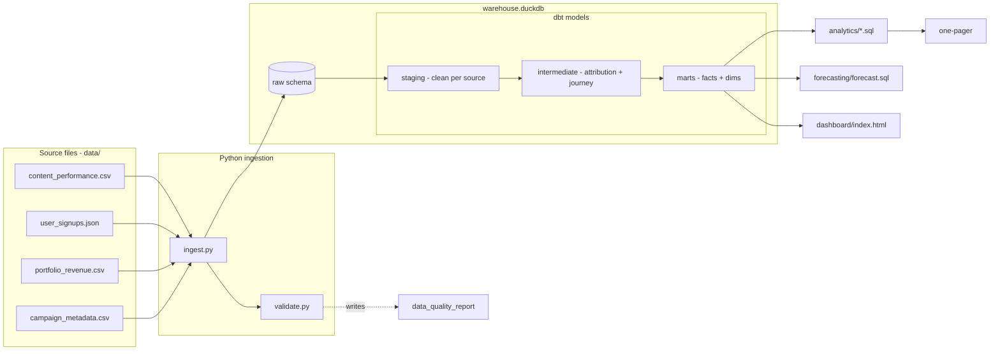

# Cross-Portfolio Revenue Attribution & Forecasting Pipeline

An end-to-end analytics pipeline that connects **content → signup → revenue** across four
portfolio companies, attributes revenue to acquisition channels under **two models**
(last-touch and first-touch), and produces a CEO-ready one-pager.

> **Headline result:** Owned content — led by **YouTube and Instagram** — drives **~79%** of
> the **$4,011,694.74** in tracked customer revenue. The top-3 channels are stable across both
> attribution models (trustworthy); the mid-tier and campaign-level ROI are not (documented below).

**Deliverables at a glance**

| Deliverable | Where |
|---|---|
| One-pager (memo) | [`reports/one_pager.md`](reports/one_pager.md) |
| Attribution dashboard (last-touch vs first-touch) | [live artifact](https://claude.ai/code/artifact/80d8ccd6-4005-4a7c-bc43-d468f6cea1c5) · source [`dashboard/index.html`](dashboard/index.html) |
| Data validation report | [`reports/validation_report.md`](reports/validation_report.md) (generated) |
| Analytics query outputs | [`analytics/output/*.csv`](analytics/) (generated) |

---

## Quickstart

Requires **Python 3.10+**. Everything runs locally against a single DuckDB file — no cloud, no server.

```bash
make setup      # create .venv and install duckdb, dbt-duckdb, pandas
make all        # ingest -> dbt build (models + tests) -> analytics
```

`make all` runs three stages and prints results:

1. **Ingest + validate** → loads the 4 sources into `warehouse.duckdb` and writes `reports/validation_report.md`
2. **dbt build** → builds 15 models and runs 63 tests (all pass)
3. **Analytics** → runs the 5 analysis queries + forecast, writes `analytics/output/*.csv`

Individual stages: `make ingest`, `make dbt`, `make analytics`. `make data` regenerates the
seed files deterministically (`python generate_data.py`). `make clean` removes generated artifacts.

Inspect the warehouse directly:

```bash
.venv/bin/python -c "import duckdb; print(duckdb.connect('warehouse.duckdb').execute(\
  'select last_touch_channel, round(sum(revenue_amount)) from main_marts.fct_attributed_revenue group by 1 order by 2 desc').fetchall())"
```

---

## Architecture



**Warehouse choice — DuckDB.** The brief prefers BigQuery but accepts DuckDB/Postgres, and
weights "we will run your code" heavily. DuckDB is a single file with zero setup, so the pipeline
runs first-try on any machine. The SQL is standard/portable; retargeting BigQuery means swapping
[`transform/profiles.yml`](transform/profiles.yml) for a `bigquery` block — the models don't change.

---

## Data model

Layered dbt project ([`transform/`](transform/)), one responsibility per layer:

| Layer | Models | Grain | Purpose |
|---|---|---|---|
| **staging** | `stg_content_performance`, `stg_user_signups`, `stg_portfolio_revenue`, `stg_campaign_metadata` | source row | Type/clean, normalize channels, attach data-quality flags |
| **intermediate** | `int_user_attribution`, `int_user_revenue`, `int_user_journey`, `int_campaign_attribution` | user (or user×campaign) | Resolve attribution, stitch journey, match campaigns |
| **marts** | `fct_attributed_revenue`, `fct_content_performance`, `fct_campaign_roi`, `dim_channel`, `dim_company`, `dim_user_cohort`, `dim_time` | see below | Business-ready facts + dimensions |

**`fct_attributed_revenue`** is the core fact — **grain = one row per revenue record** (user × month),
enriched with both `first_touch_channel` and `last_touch_channel`. Because it's a 1:1 enrichment of
revenue rows (each row has one user, each user one attribution record), switching attribution model is
a `GROUP BY` change, not a re-join — which is what makes reconciliation exact (below).

---

## Attribution models & the messy-data judgment

### The two models
- **Last-touch** — 100% credit to the channel the user came through *immediately before signing up*.
- **First-touch** — 100% credit to the channel that *first* brought the user in.

They agree on the **71%** of users whose first and last touch are the same channel, and diverge on
the other **29% (1,808 users)** — which is exactly where the interesting signal is.

| | Last-touch | First-touch | When to use |
|---|---|---|---|
| Credits | the closer | the opener | Last-touch for "what sealed the deal"; first-touch for "what fills the funnel" |
| Biggest beneficiary | Referral (+$88K vs first) | YouTube (+$59K vs first) | Referral closes; YouTube discovers |
| Bias | undervalues discovery | undervalues nurture | Report both; never pick one silently |

### How the conflicting / missing-UTM users were resolved (the graded part)
The decisive insight: **`first_touch_channel` and `last_touch_channel` are never null**, so *channel*
attribution never requires dropping a user. The messy UTMs affect *campaign/content* linkage, not the
channel. Concretely:

1. **Channel = the touch-channel fields.** `utm_source` / `referral_source` are treated as *corroborating*
   signals, never overriding the recorded touch channel. This keeps 100% of revenue attributable.
2. **Every user gets one `attribution_quality` label** (in `int_user_attribution`), prioritised by the
   issue that most affects attribution — nothing is silently dropped:

   | Label | Users | Meaning |
   |---|---:|---|
   | `clean` | 3,610 | first = last, consistent signals |
   | `touch_conflict` | 1,808 | first ≠ last — models diverge here |
   | `organic_no_utm` | 369 | organic; null `utm_source` is **correct, not dirty** |
   | `referral_mismatch` | 278 | `referral_source` contradicts the UTM channel |
   | `utm_tracking_loss` | 105 | non-organic but missing `utm_source` (genuine loss) |

3. **Organic ≠ dirty.** 636 of 786 "missing utm_source" users are organic (null by design). Only ~150 are
   true tracking loss. Lumping them together would overstate data quality problems — so they're split.
4. **The `utm_campaign` tag is untrustworthy and is *not* used for campaign attribution.** ~71% of users'
   `utm_campaign` points at a channel matching *neither* touch, and ~64% at the *wrong company*. Campaign ROI
   instead matches on the campaign's own `channel` + `target_company` + active window (see below).

### Reconciliation — "to the penny"
Enrichment must not add, drop, or duplicate a dollar. Enforced by dbt tests:
- [`assert_revenue_reconciles_to_source.sql`](transform/tests/assert_revenue_reconciles_to_source.sql) — fact total = source total = **$4,011,694.74**
- [`assert_attributed_not_exceeds_total.sql`](transform/tests/assert_attributed_not_exceeds_total.sql) — **required test**: fails if attributed revenue (either model) exceeds total
- [`assert_row_count_matches_source.sql`](transform/tests/assert_row_count_matches_source.sql) — exactly one fact row per source revenue row (no fan-out)
- [`assert_campaign_attribution_not_exceeds_total.sql`](transform/tests/assert_campaign_attribution_not_exceeds_total.sql) — campaign split allocation stays bounded

The recurring-revenue **double-count trap**: `portfolio_revenue` has ~27,426 rows for 6,170 users. A naive
`campaign → user → revenue` join would duplicate budgets across a user's monthly rows. `fct_campaign_roi`
aggregates spend and revenue **separately** then joins, and `int_campaign_attribution` splits a user's
revenue `1/N` across the N campaigns they match — so nothing is counted twice.

---

## Analytics queries

Five standard-SQL queries in [`analytics/`](analytics/), run by `analytics/run_analytics.py`
(outputs to `analytics/output/*.csv`):

1. **Channel revenue ranking** — both models side-by-side, with rank and delta columns.
2. **Campaign ROI** — spend vs attributed revenue per campaign, ranked by efficiency, plus a coverage row
   (only **10.9%** of revenue can be confidently tied to a campaign).
3. **CAC by channel per company** — spend ÷ customers acquired; organic/referral shown with NULL CAC (no spend).
4. **Cohort retention by channel** — signup-month cohorts × months-since-signup. Finding: retention is
   ~flat across channels (~4.4 months) → channel drives *volume*, not *value*.
5. **Revenue trend by channel** — MoM growth + 3-month trailing average.

---

## Forecasting — methodology & limitations

**Method** ([`forecasting/forecast.sql`](forecasting/forecast.sql)): a simple **3-month trailing moving
average**, projected flat for the next 3 months, per company. Output pairs the last 6 actual months with
the 3 forecast months. Deliberately simple — per the brief, the forecast is not the differentiator.

**Limitations (when it breaks down):**
- **Truncation is the big one.** The sample stops acquiring users after **2025-06**, so months after that
  are a *run-off* of the existing book (revenue decays from ~$237K/mo toward ~$12K/mo). The trailing MA
  therefore projects the *decay*, not a business trajectory. In production with ongoing acquisition, you'd
  anchor the forecast on the acquisition-active plateau instead of the tail. **Treat the numeric forecast
  as a mechanical baseline, not a prediction.**
- No seasonality or trend term — a flat MA can't turn corners.
- Short history (30 months) and small per-company samples widen the error.

---

## Assumptions & trade-offs (shortcuts taken)

- **DuckDB over BigQuery** — chosen for runnability; SQL kept portable. No cloud deploy.
- **First-touch as the second model** — the data has only two touchpoints, so linear/time-decay collapse
  toward first/last; first-touch gives the cleanest, most defensible contrast.
- **Campaign matching uses last-touch + window + company** — a defensible rule given the unreliable tag;
  it intentionally leaves ~89% of revenue *unattributed to any campaign* rather than forcing bad matches.
- **`revenue_type` treated as constant per user** — verified true in the data (a user is all one-time or all
  recurring), which lets it collapse to user grain cleanly.
- **dbt 1.12 deprecation warnings** — the classic `accepted_values` test syntax emits a cosmetic deprecation
  warning; kept for portability across dbt versions. All tests pass.

## Future improvements
- Multi-touch attribution (linear / time-decay / position-based) once a full touchpoint *path* per user exists.
- Anomaly detection on channel trend (flag months deviating from a rolling band).
- A proper cohort LTV model and survival-based forecast that corrects for the acquisition-window truncation.
- Orchestration (Prefect/Airflow) + dbt exposures for end-to-end lineage; scheduled freshness tests.
- Retarget BigQuery and add CI that runs `dbt build` on every PR.

## Repo layout
```
data/                     seed source files (+ generate_data.py to reproduce)
ingestion/                ingest.py (raw load) · validate.py (quality report) · config.py
transform/                dbt project — models/{staging,intermediate,marts} · tests/ · profiles.yml
analytics/                01..05 SQL queries · run_analytics.py · output/
forecasting/              forecast.sql
reports/                  one_pager.md · validation_report.md
dashboard/                index.html (self-contained attribution dashboard)
Makefile                  setup / data / ingest / dbt / analytics / all / clean
```
